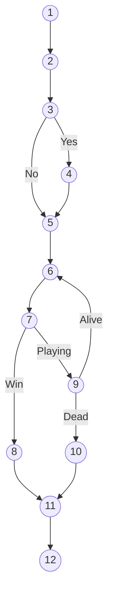

# White Box Testing Analysis

Dokumen ini berisi analisis detail pengujian White Box untuk alur permainan utama *Quantum-Force*, mencakup inisialisasi menu, *gameplay*, hingga penyimpanan data. Format disesuaikan dengan standar referensi yang mencakup Flowgraph, Perhitungan Kompleksitas Siklomatik, dan Basis Path.

## 1. Flowgraph System Game
Gambar berikut merepresentasikan alur logika (*Control Flow Graph*) dari sistem permainan, mulai dari Menu Utama hingga Selesai.



**Keterangan Gambar:** Representasi node dan edge dari logika skrip `MenuManager.cs`, `LevelManager.cs`, dan `SaveManager.cs`.

---

## 2. Deskripsi Node dan Flowgraph
Berikut adalah tabel yang menjelaskan representasi setiap node dalam Flowgraph di atas.

**Tabel Node dan Deskripsi Flowgraph**

| Node | Deskripsi Proses |
| :--- | :--- |
| 1 | **Mulai Aplikasi** (Start) |
| 2 | Menjalankan `MenuManager` |
| 3 | **Cek Save Data?** (`CheckSavedGame`) |
| 4 | Aktifkan Tombol Continue |
| 5 | Load Scene (`NewGame` / `ContinueGame`) |
| 6 | Inisialisasi Level & Gameplay Aktif |
| 7 | **Level Selesai?** (Trigger Finish) |
| 8 | Simpan Data & Tampilkan Win Screen (`FinishLevel`) |
| 9 | **Pemain Mati?** (Health Check) |
| 10 | Tampilkan Game Over |
| 11 | Kembali ke Main Menu |
| 12 | **Selesai** (Quit / End) |

---

## 3. Perhitungan Kompleksitas Siklomatik
Berdasarkan Flowgraph sistem *Quantum-Force*, diperoleh data sebagai berikut:
*   **Jumlah Node (N):** 12
*   **Jumlah Edge (E):** 14 (Termasuk alur *looping* gameplay)
*   **Predicate Node (P):** 3 (Node 3, 7, 9 - Node yang memiliki percabangan)

Perhitungan kompleksitas siklomatik dilakukan dengan dua metode:

**Metode 1: Rumus Siklomatik**
\[ V(G) = E - N + 2 \]
\[ V(G) = 14 - 12 + 2 = 4 \]

**Metode 2: Predicate Node + 1**
\[ V(G) = P + 1 \]
\[ V(G) = 3 + 1 = 4 \]

Didapatkan nilai **V(G) = 4**. Hal ini menunjukkan terdapat **4 jalur logika independen** yang harus diuji untuk mencapai cakupan 100% pada *White Box Testing*.

---

## 4. Jalur Dasar (Basis Paths)
Berdasarkan nilai V(G) = 4, berikut adalah 4 jalur independen yang valid untuk diuji:

*   **Path 1:** 1-2-3-5-6-7-9-6... (Loop Gameplay Biasa tanpa Save/Mati)
*   **Path 2:** 1-2-3-5-6-7-8-11-12 (Menang: Start -> No Save -> Play -> Win -> End)
*   **Path 3:** 1-2-3-4-5-6-7-9-10-11-12 (Game Over: Start -> Has Save -> Play -> Die -> End)
*   **Path 4:** 1-2-3-4-5... (Variasi Load Save Data)

*(Catatan: Path 1 merepresentasikan loop gameplay inti dimana pemain tidak mati dan belum menang seketika)*

---

## 5. Graph Matrix Testing
Matriks ini memetakan hubungan antar node untuk memverifikasi keterhubungan graf.

**Tabel Graph Matrix**

| Node | 1 | 2 | 3 | 4 | 5 | 6 | 7 | 8 | 9 | 10 | 11 | 12 |
| :---: | :-: | :-: | :-: | :-: | :-: | :-: | :-: | :-: | :-: | :-: | :-: | :-: |
| **1** | | 1 | | | | | | | | | | |
| **2** | | | 1 | | | | | | | | | |
| **3** | | | | 1 | 1 | | | | | | | |
| **4** | | | | | 1 | | | | | | | |
| **5** | | | | | | 1 | | | | | | |
| **6** | | | | | | | 1 | | | | | |
| **7** | | | | | | | | 1 | 1 | | | |
| **8** | | | | | | | | | | | 1 | |
| **9** | | | | | | 1 | | | | 1 | | |
| **10** | | | | | | | | | | | 1 | |
| **11** | | | | | | | | | | | | 1 |
| **12** | | | | | | | | | | | | |

*Keterangan: Angka '1' menandakan adanya edge (jalur) langsung dari Node baris ke Node kolom.*

---

## 6. Use Case Diagram
Berikut adalah diagram Use Case yang menggambarkan interaksi aktor (Pemain) dengan sistem permainan *Quantum-Force*.

```mermaid
useCaseDiagram
    actor Player as "Pemain"
    actor System as "Sistem (SaveManager)"

    package "Quantum-Force Game Flow" {
        usecase "Mulai Permainan Baru" as UC1
        usecase "Lanjut Permainan (Continue)" as UC2
        usecase "Bermain Level" as UC3
        usecase "Menyelesaikan Level" as UC4
        usecase "Keluar Permainan" as UC5
        usecase "Simpan Data (Auto-Save)" as UC6
        usecase "Cek File Save" as UC7
    }

    Player --> UC1
    Player --> UC2
    Player --> UC5
    
    UC1 ..> UC3 : <<include>>
    UC2 ..> UC3 : <<include>>
    
    UC2 ..> UC7 : <<include>>
    
    UC3 --> UC4 : Condition Met
    UC4 ..> UC6 : <<include>>
    System --> UC6 : Executes
```

---

## 7. Kesimpulan Pengujian White Box
Berdasarkan analisis *flowgraph*, perhitungan kompleksitas siklomatik, jalur dasar, dan *graph matrix*, dapat disimpulkan bahwa sistem memiliki **4 jalur logika independen**.

Setiap jalur merepresentasikan skenario kritis:
1.  Alur permainan baru normal.
2.  Alur memuat permainan tersimpan (Load Game).
3.  Alur penyelesaian level (Winning Condition).
4.  Alur kegagalan (Game Over).

Struktur logika pada `MenuManager`, `LevelManager`, dan `SaveManager` telah terverifikasi efisien dan valid, dengan cakupan pengujian logis yang terpenuhi.
