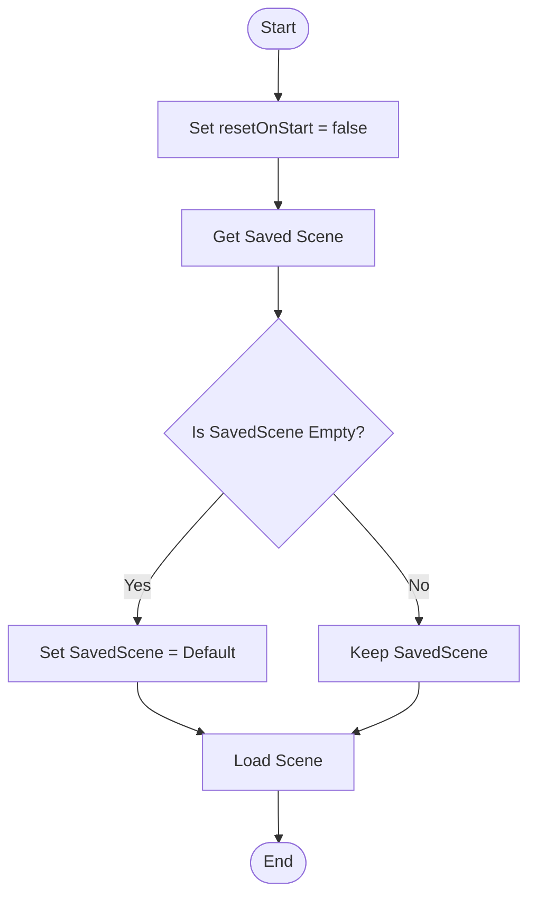
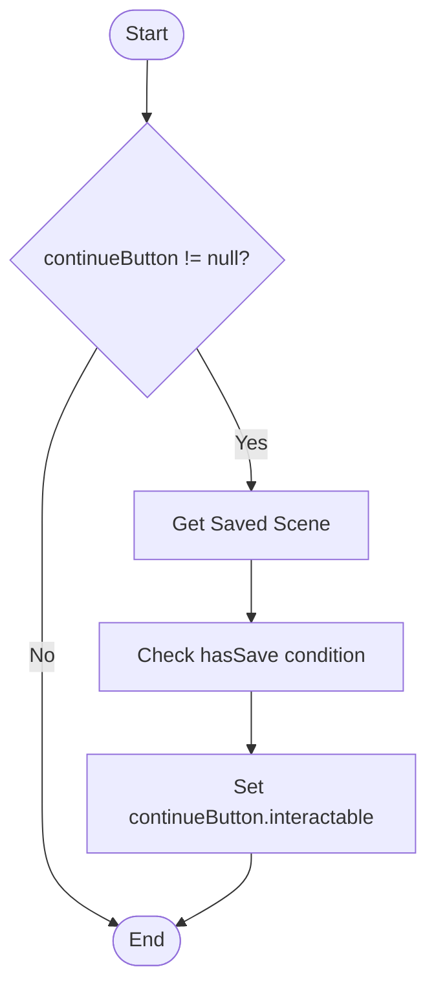
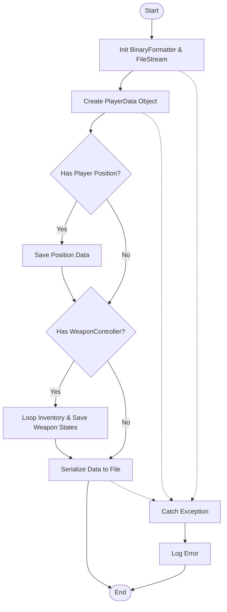
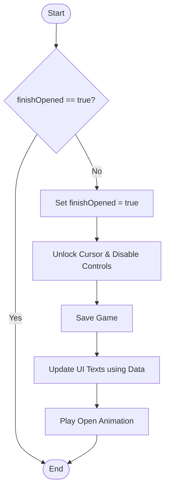

# White Box Testing - Flowgraphs

Dokumen ini merepresentasikan **Control Flow Graph (CFG)** untuk beberapa fungsi utama yang diuji dalam White Box Testing.

## 1. MenuManager: ContinueGame()
Fungsi ini menangani logika memuat permainan yang tersimpan.

**Logika:**
1.  Set flag `resetOnStart` ke `false`.
2.  Ambil nama scene yang tersimpan.
3.  **Decision Node:** Apakah nama scene kosong?
    *   **Yes:** Gunakan default scene ("Gameplay").
    *   **No:** Gunakan scene yang tersimpan.
4.  Load Scene.

## 2. MenuManager: CheckSavedGame()
Fungsi ini menentukan apakah tombol "Continue" harus aktif atau tidak.

**Logika:**
1.  **Decision Node:** Apakah `continueButton` tidak null?
    *   **No:** Selesai.
    *   **Yes:** Lanjut.
2.  Ambil nama scene tersimpan.
3.  Cek apakah scene valid ATAU file save ada.
4.  Set properti `interactable` pada tombol sesuai hasil cek.

## 3. SaveManager: SaveGame()
Fungsi ini menyimpan data permainan ke file binary.

**Logika:**
1.  Inisialisasi `BinaryFormatter` & `FileStream`.
2.  Buat objek data (`PlayerData_Storage`).
3.  **Decision Node:** Apakah `playerPosition` ada nilainya?
    *   **Yes:** Simpan posisi pemain.
    *   **No:** Lewati.
4.  **Decision Node:** Apakah `weaponController` ada (save inventory)?
    *   **Yes:** Loop slot inventory -> Simpan state senjata.
    *   **No:** Lewati.
5.  Serialize data ke file.
6.  **Exception Handling:** Jika error, log error.

## 4. LevelManager: FinishLevel()
Fungsi yang dipanggil saat pemain menyelesaikan level.

**Logika:**
1.  **Decision Node:** Apakah `finishOpened` sudah true?
    *   **Yes:** Return (cegah spam).
    *   **No:** Set `finishOpened` = true.
2.  Unlock kursor & disable player control.
3.  Save Game.
4.  Update teks UI (Timer, Score).
5.  Mainkan animasi panel (LeanTween).

